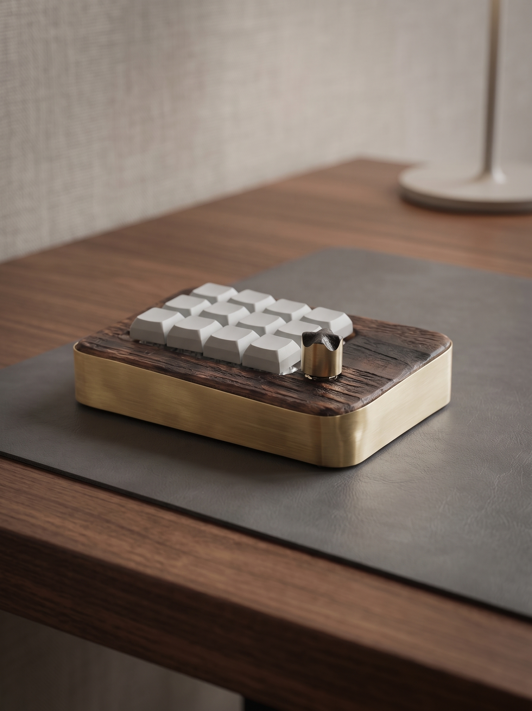
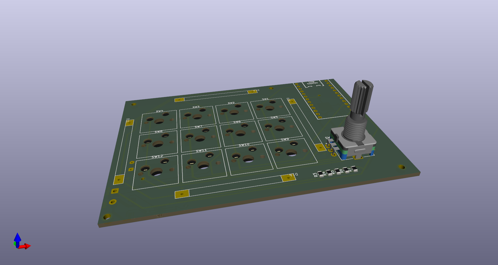
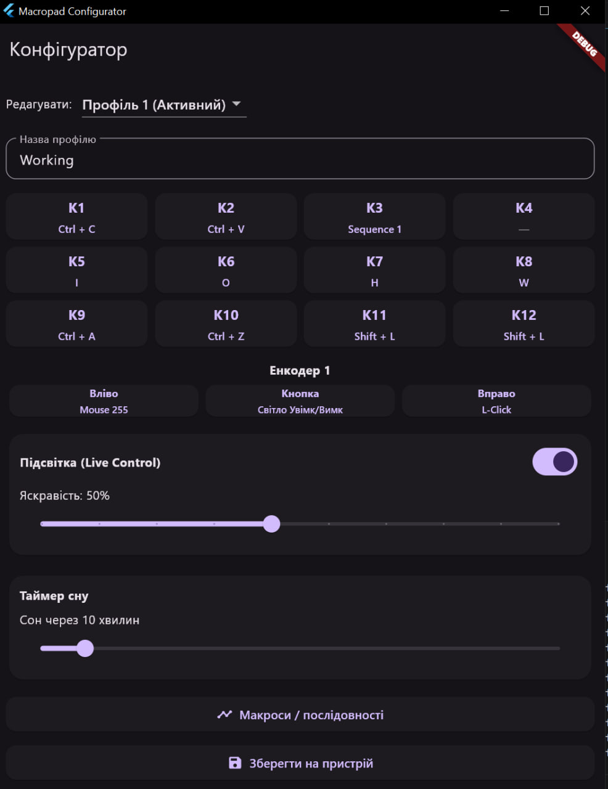

# nRF52840 Custom Wireless Macropad

<p align="center">
  
</p>

An end-to-end open-source wireless macropad built on top of the **Nordic nRF52840** SoC. The system features custom hardware design, **Zephyr RTOS** multi-threaded firmware, and a dedicated **Flutter** desktop companion application for cross-platform configuration.

---

## ⚡ Key Highlights

* **Nordic nRF52840 SoC**: BLE HID keyboard & mouse profiles with low-power optimizations.
* **Dual Layer Architecture**: Full-featured matrix scanning + rotary encoder control.
* **Zephyr RTOS Engine**: Event-driven multitasking, hardware-accelerated BLE stack, and flash settings storage.
* **Companion App**: Cross-platform desktop GUI (Windows/Linux) built with Flutter for live keymap reassignment and sequence management.
* **Custom PCB**: Designed from schematic to Gerber files using KiCad.

---

## 🛠️ System Overview

### 1. Hardware Design (KiCad)
Custom schematic and 2-layer PCB layout developed in KiCad, optimized for Nordic nRF52-series wireless routing and mechanical switch integration.

<p align="center">
  
</p>

* KiCad project source files, schematics (PDF), and production-ready Gerbers are located in the [`/Hardware`](./Hardware) directory.

---

### 2. Firmware (Zephyr RTOS / C++)
Event-driven embedded architecture leveraging modern RTOS primitives:
* **Key Matrix Scanner**: Hardware debounce and rapid matrix polling.
* **Encoder Handler**: Hardware quadrature decoding with acceleration.
* **BLE HID Profile**: Seamless connectivity and automatic reconnect routine.
* **Power Management**: Aggressive sleep and system-off modes for prolonged battery endurance.

Source code and build instructions are located in the [`/Firmware`](./Firmware) directory.

---

### 3. Desktop Software (Flutter)
A responsive desktop application for live parameter synchronization over BLE:

<p align="center">
  
</p>

* Intuitive matrix binding and layer configuration.
* Macro sequence editor with custom delays.
* Real-time battery status and profile switcher.

Source code and setup instructions are located in the [`/Software`](./Software) directory.

---

## 📂 Repository Structure

```text
├── Hardware/   # KiCad schematics, PCB layout, Gerbers, BOM
├── Firmware/   # Zephyr RTOS source code, devicetree overlays, prj.conf
├── Software/   # Flutter configuration application source
└── docs/       # Media, hardware photos, and diagrams
